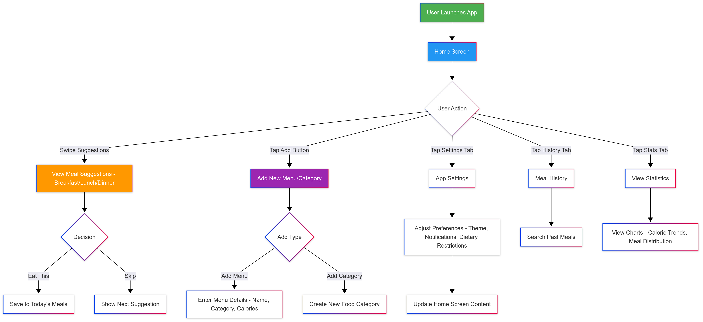
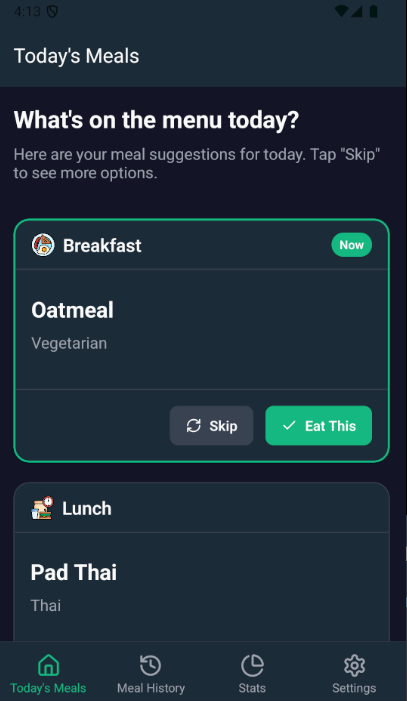
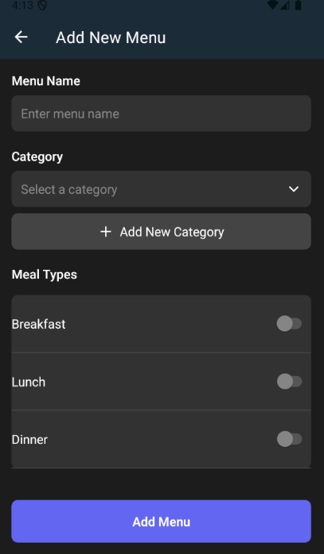
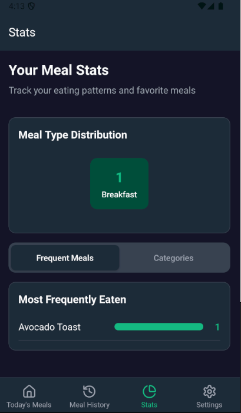
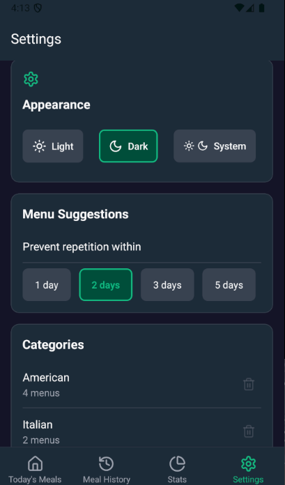

# 📱 แบบฟอร์มส่งงานสอบ Take-home | Take-home Assignment Template
**ชื่อ - นามสกุล (Full Name):** Butsarin Chomchat

**รหัสนักศึกษา (Student ID):** 6631503111

**ชื่อแอป (App Name):** Entify 

**Framework ที่ใช้ (Framework Used):** React Native 

**ลิงก์ GitHub Repository:** [https://github.com/bearbabe0420/eatify1.git] 

**ลิงก์ไฟล์ติดตั้ง (APK/IPA):** [file:///D:/food-suggestion/food-suggestion/AppFile/application-ef155859-c54a-4443-9f6f-8b8b84bcdd2c.apk] **

---

## 1. การออกแบบแอป | App Concept and Design (2 คะแนน / 2 pts)

### 1.1 ผู้ใช้งานเป้าหมาย | User Personas  
```markdown
Persona 1:  
- ชื่อ: นีน่า
- อายุ: 20 ปี  
- อาชีพ: นักศึกษาปี 2  
- ความต้องการ:ต้องการเมนูอาหารโดยไม่ซ้ำภายใน 3 วัน และเลือกประเภทอาหารได้

Persona 2: 
- ชื่อ: สาธุ
- อายุ: 19 ปี  
- อาชีพ: นักศึกษาปี 2
- ความต้องการ:ต้องการเมนูอาหารโดยไม่ต้องคิดเอง และบันทึกการกินในแต่ละวัน

Persona 3: 
- ชื่อ: โบว์
- อายุ: 20 ปี  
- อาชีพ: นักศึกษาปี 2
- ความต้องการ:ต้องการข้อสรุปการกินในแต่ละวัน หรือรายสัปดาห์
`````

### 1.2 เป้าหมายของแอป | App Goals  

```markdown
-สุ่มเมนูอาหารในแต่ละมื้อ (เช้า/กลางวัน/เย็น)
-เมนูไม่ซ้ำภายใน 3 วัน
-เลือกหมวดหมู่อาหารก่อนสุ่มได้
-บันทึกเมนูที่รับประทานในแต่ละวัน
-แสดงแดชบอร์ดเมนูที่กินบ่อยที่สุด
```

### 1.3 โครงร่างหน้าจอ / Mockup  
**ใส่รูปภาพ หรือคำอธิบายแต่ละหน้าหลัก 3 หน้า | Attach image or describe 3 main pages**

### 1.4 การไหลของผู้ใช้งาน | User Flow  



```


## 2. การพัฒนาแอป | App Implementation (4 คะแนน / 4 pts)

### 2.1 รายละเอียดการพัฒนา | Development Details  
**เครื่องมือที่ใช้ / Tools used:**
```markdown
- React-native 0.76.9
- Javascrpit 11.2.0
- Package: NPM, EXPO
```

### 2.2 ฟังก์ชันที่พัฒนา | Features Implemented  
**Checklist:**
```markdown
- []สุ่มเมนูอาหารในแต่ละมื้อ (เช้า/กลางวัน/เย็น)
- []เมนูไม่ซ้ำภายใน 3 วัน
- []เลือกหมวดหมู่อาหารก่อนสุ่มได้
- []บันทึกเมนูที่รับประทานในแต่ละวัน
- []แสดงแดชบอร์ดเมนูที่กินบ่อยที่สุด
```

### 2.3 ภาพหน้าจอแอป | App Screenshots  
**แนบภาพหรือ URL (Attach images or image links):**





---

## 3. การ Build และติดตั้งแอป | Deployment (2 คะแนน / 2 pts)

### 3.1 ประเภท Build | Build Type
- [x] Debug  
- [ ] Release  

### 3.2 แพลตฟอร์มที่ทดสอบ | Platform Tested  
- [x] Android  
- [ ] iOS  

### 3.3 ไฟล์ README และวิธีติดตั้ง | README & Install Guide  
**แนบไฟล์หรือคำอธิบายการติดตั้งแอป | Insert steps**
```markdown
1. ดาวน์โหลดไฟล์ .apk
2. เปิดในอุปกรณ์ Android 
3. ติดตั้งผ่าน File Manager
```

---

## 4. การสะท้อนผลลัพธ์ | Reflection (2 คะแนน / 2 pts)

**ตัวอย่างหัวข้อ | Suggested points:**
```markdown
- พบปัญหาเวลา skip meal โดย meal จะเปลี่ยนทั้งวันแทนที่จะเป็นของช่วงเวลานั้น
- เรียนรู้การแยก theme ออกมาเป็นตัวแปร
- หากมีเวลา จะเพิ่มฟีเจอร์จัดเซ็ทอาหารเป็นวัน
```

---

## 5. การใช้ AI ช่วยพัฒนา | AI Assisted Development (Bonus / ใช้ประกอบการพิจารณา)

### 5.1 ใช้ AI ช่วยคิดไอเดีย | Idea Generation
```markdown
Prompt ที่ใช้:  
"Suggest mobile app ideas for find meals by time of day."

ผลลัพธ์: Daily Food Randomizer App – Simple and Practical Idea!
Here are the main features the app should have:
1. Meal Randomization
A button to randomly suggest a meal from a pre-set list.
Display the meal name along with an image (if available).
2. Food Category Selection (optional but very useful)
Allow users to choose a category before randomizing, such as:
One-dish meals
Thai food
Made-to-order meals
Clean eating / Healthy food
3. Daily Meal Logging
Record which meals were eaten today and yesterday.
Display in a small calendar view or a simple daily list.
4. Add/Delete Meals
Let users add their own meals to the system.
Allow setting a name, uploading a picture, and selecting a category.
5. "Re-Roll" Button
If users don't like the random suggestion, they can quickly re-roll
(Optional: prevent suggesting the same meal as the previous one.)
6. (Optional) Link to Recipes or Cooking Instructions
Provide a link to YouTube or recipe websites when a meal is selected.
7. (Optional) Notification Reminders
Set daily notifications (e.g., at noon or evening) reminding users to randomize their meal. 
```

### 5.2 ใช้ AI ช่วยออกแบบ UI | UI Layout Prompt
```markdown
Prompt ที่ใช้:  
"Enhance the Expo (React Native) application with a vibrant and user-friendly interface, primarily using green as the main color scheme. The UI should display a single, randomized food suggestion for each meal (Breakfast, Lunch, Dinner)"

ผลลัพธ์:  
ได้ code structure ของ theme-context.tsx
```

### 5.3 ใช้ AI ช่วยเขียนโค้ด | Code Writing Prompt
```markdown
Prompt ที่ใช้:  
"I want to implement method to random meal. It should random only meal in range of MealType"

ผลลัพธ์:  
แก้ไขฟังชั่นให้ random ในขอบเขต array ของ MealType
```

### 5.4 ใช้ AI ช่วย debug | Debug Prompt
```markdown
Prompt ที่ใช้:  
"My expo app can't run because expo doesn't compatible with current dependency"

ผลลัพธ์:  
AI แนะนำให้ตรวจสอบ dependency และให้ cli มาแก้ไข
```

### 5.5 ใช้ AI ช่วย Deploy | Deployment Prompt
```markdown
Prompt ที่ใช้:  
"How to build expo app as APK and test on Android?"

ผลลัพธ์:  
คำสั่ง eas build  พร้อมวิธีติดตั้ง
```

---

## ✅ Checklist ก่อนส่ง | Final Checklist
- [x] กรอกข้อมูลครบทุก Section  
- [x] แนบ GitHub และไฟล์ติดตั้ง  
- [x] สะท้อนผล และใช้ AI อย่างมีเหตุผล  
